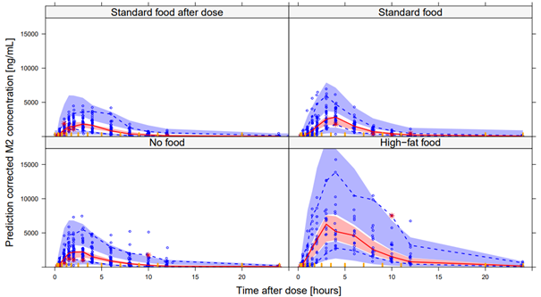

# Supplementary materials to: Population pharmacokinetics and exposure-response of BTZ-043 for the treatment of tuberculosis.

## Table of Contents

- [Estimated PK model parameters](#Estimated-PK-model-parameters)
- [Estimated PD model parameters](Estimated-PD-model-parameters)
- [VPC of BTZ-043 stratified on food-type](VPC-of-BTZ-043-stratified-on-food-type)
- [VPC of M1 stratified on food-type](VPC-of-M1-stratified-on-food-type)
- [VPC of M2 stratified on food-type](VPC-of-M2-stratified-on-food-type)

## Estimated PK model parameters

|     Parameter                                          |     Estimate (95% CI SIR)    |     Variability (CV%) (95% CI SIR)                      |
|--------------------------------------------------------|------------------------------|---------------------------------------------------------|
|     Structural parameters                              |                              |                                                         |
|     CL/F (L/h)                                         |     404 (327-479)            |     27.2 (21.0-35.4)                                    | 
|     V/F (L)                                            |     764 (303-953)            |     43.3 (33.3-55.8)                                    |
|     Ka (h-1)                                           |     1.69 (1.35-2.21)         |     128 (97.6-173)                                      |   
|     F (%)                                              |     1 FIX                    |     IOV= 23.6 (20.0-27.4)     IIV = 26.5 (19.3-35.7)    |  
|     MTT (h)                                            |     0.340 (0.270-0.419)      |     92.8 (76.3-116)                                     |   
|     Fraction parallel absorption with food (%)         |     0.644 (0.606-0.679)      |                                                         |  
|     Lagtime parallel absorption with food (h)          |     1.83 (1.76-1.90)         |                                                         |   
|     QBTZ-043/F (L/h)                                   |     68.0 (55.0-81.3)         |                                                         |   
|     VpBTZ-043/F (L)                                    |     382 (310-449)            |                                                         | 
|     CLM1/(F*fmM1) (L/h)                                |     36.0 (29.3-43.2)         |     43.6 (33.2-56.9)                                    |  
|     VM1/(F*fmM1) (L)                                   |     894 (699-1100)           |     48.6 (39.0-60.8)                                    | 
|     CLM2/(F*fmM2) (L/h)                                |     45.8 (37.8-54.4)         |     30.3 (24.6-36.0)                                    |  
|     VM2/(F*fmM2) (L)                                   |     19.0 (13.4-25.8)         |     108 (73.3-180)                                      |  
|     QM2/(F*fmM2) (L/h)                                 |     64.2 (38.6-99.5)         |                                                         |   
|     VpM2/(F*fmM2) (L)                                  |     26.8 (21.4-33.2)         |                                                         |   
|     Correlation MTT – Ka (%)                           |     44.4 (27.8-54.9)         |                                                         |   
|     Covariates                                         |                              |                                                         |   
|     Dose (>1250mg) on F (%)                            |     0.710 (0.510-0.980)      |                                                         |   
|     High-fat food on F (%)                             |     1.41 (1.05-1.78)         |                                                         | 
|     Dose prior to standard food on F (%)               |     0.727 (0.583-0.883)      |                                                         | 
|     No food on F (%)                                   |     0.458 (0.352-0.569)      |                                                         |  
|     Dose prior to standard food/ no food on MTT (%)    |     0.36 (0.276-0.468)       |                                                         | 
|     Administration with food on FM1   (%)              |     1.39 (1.34-1.44)         |                                                         |  
|     Cape-colored race on CL/F (%) a                    |     0.762 (0.654-0.885)      |                                                         |   
|     Time effect on CLM2/(F*fmM2)    (%) b              |     0.734 (0.708-0.761)      |                                                         |  
|     Residual error                                     |                              |                                                         |  
|     Proportional error BTZ-043 (CV%)                   |     50.5 (47.7-53.4)         |                                                         |  
|     Proportional error M1 (CV%)                        |     33.8 (32.4-35.1)         |                                                         |   
|     Proportional error M2 (CV%)                        |     29.0 (28.0-30.1)         |                                                         | 

CV% was calculated as sqrt(exp(OM^2)-1). Disposition parameters were allometrically scaled using a reference total body weight of 70kg. 
a Parameterized as percentage slower in cape-colored participants vs. other participants. 
b Parameterized as decrease in clearance after day 10 compared to before day 10.

## Estimated PD model parameters

|     Parameter                                          |     Estimate (95% CI SIR)    |     Variability (CV%) (95% CI SIR)                      |  
|--------------------------------------------------------|------------------------------|---------------------------------------------------------|
|     Structural parameters                              |                              |                                                         | 
|     CL/F (L/h)                                         |     404 (327-479)            |     27.2 (21.0-35.4)                                    |  
|     V/F (L)                                            |     764 (303-953)            |     43.3 (33.3-55.8)                                    |  
|     Ka (h-1)                                           |     1.69 (1.35-2.21)         |     128 (97.6-173)                                      | 
|     F (%)                                              |     1 FIX                    |     IOV= 23.6 (20.0-27.4)     IIV = 26.5 (19.3-35.7)    |  
|     MTT (h)                                            |     0.340 (0.270-0.419)      |     92.8 (76.3-116)                                     |   
|     Fraction parallel absorption with food (%)         |     0.644 (0.606-0.679)      |                                                         |   
|     Lagtime parallel absorption with food (h)          |     1.83 (1.76-1.90)         |                                                         |   
|     QBTZ-043/F (L/h)                                   |     68.0 (55.0-81.3)         |                                                         |  
|     VpBTZ-043/F (L)                                    |     382 (310-449)            |                                                         |   
|     CLM1/(F*fmM1) (L/h)                                |     36.0 (29.3-43.2)         |     43.6 (33.2-56.9)                                    |  
|     VM1/(F*fmM1) (L)                                   |     894 (699-1100)           |     48.6 (39.0-60.8)                                    |   
|     CLM2/(F*fmM2) (L/h)                                |     45.8 (37.8-54.4)         |     30.3 (24.6-36.0)                                    |  
|     VM2/(F*fmM2) (L)                                   |     19.0 (13.4-25.8)         |     108 (73.3-180)                                      |   
|     QM2/(F*fmM2) (L/h)                                 |     64.2 (38.6-99.5)         |                                                         | 
|     VpM2/(F*fmM2) (L)                                  |     26.8 (21.4-33.2)         |                                                         | 
|     Correlation MTT – Ka (%)                           |     44.4 (27.8-54.9)         |                                                         |   
|     Covariates                                         |                              |                                                         |  
|     Dose (>1250mg) on F (%)                            |     0.710 (0.510-0.980)      |                                                         |   
|     High-fat food on F (%)                             |     1.41 (1.05-1.78)         |                                                         |   
|     Dose prior to standard food on F (%)               |     0.727 (0.583-0.883)      |                                                         |   
|     No food on F (%)                                   |     0.458 (0.352-0.569)      |                                                         |   
|     Dose prior to standard food/ no food on MTT (%)    |     0.36 (0.276-0.468)       |                                                         |   
|     Administration with food on FM1   (%)              |     1.39 (1.34-1.44)         |                                                         |   
|     Cape-colored race on CL/F (%) a                    |     0.762 (0.654-0.885)      |                                                         |  
|     Time effect on CLM2/(F*fmM2)    (%) b              |     0.734 (0.708-0.761)      |                                                         | 
|     Residual error                                     |                              |                                                         |   
|     Proportional error BTZ-043 (CV%)                   |     50.5 (47.7-53.4)         |                                                         |   
|     Proportional error M1 (CV%)                        |     33.8 (32.4-35.1)         |                                                         |  
|     Proportional error M2 (CV%)                        |     29.0 (28.0-30.1)         |                                                         |  

## VPC of BTZ-043 stratified on food-type

Prediction corrected VPC showing the observed 2.5th, 50th, and 97.5th percentiles (lines) and confidence intervals from the PK model. From top left to bottom right: Predicted BTZ-043 concentrations for standard food after dose, standard food, no food, and high-fat food. 

## VPC of M1 stratified on food-type

Prediction corrected VPC showing the observed 2.5th, 50th, and 97.5th percentiles (lines) and confidence intervals from the PK model. From top left to bottom right: Predicted M1 concentrations for standard food after dose, standard food, no food, and high-fat food. 

## VPC of M2 stratified on food-type

Prediction corrected VPC showing the observed 2.5th, 50th, and 97.5th percentiles (lines) and confidence intervals from the PK model. From top left to bottom right: Predicted M2 concentrations for standard food after dose, standard food, no food, and high-fat food. 
